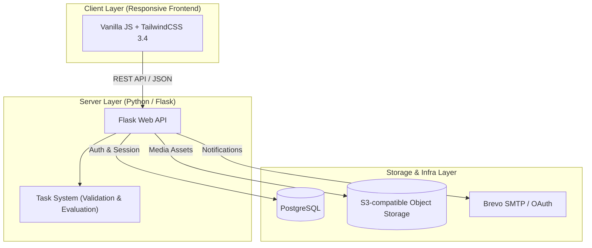

<div align="center">

# ACTRA

**Turn Passive Learning into Active Practice.** 
Convert static theory, reading lists, and lectures into interactive study sessions, smart spaced repetition, and retention analytics.

**English** | [Читать на русском](README.ru.md)

[](https://python.org)
[](https://flask.palletsprojects.com)
[](https://tailwindcss.com)
[](LICENSE)
[](https://github.com/hippo2222/ACTRA/actions/workflows/ci.yml)

</div>

---

## What is ACTRA?

ACTRA is built for active learners, students, educators, and professionals who want to maximize retention and study efficiency. By bridging theoretical content with interactive retrieval practice, ACTRA prevents passive-reading fatigue and helps you build durable memory.

> [!IMPORTANT]
> **Hosted-First Platform**: ACTRA is fully optimized for hosted web environments. The legacy desktop/webview and Windows release targets remain in the codebase for reference, but the core active development, billing integrations, and automated pipelines are tailored for high-performance web deployment.

---

## Core Architecture

ACTRA is engineered as a modern, lightweight hosted web application with client-side interactivity and robust backend storage:



---

## Key Capabilities

### 1. The Interactive Practice Loop
ACTRA goes beyond standard text inputs, offering **5 distinct, kinetic task types** to suit any learning style:
*   **Spatial Recognition (Click)**: Tap precise hot areas on images to test visual structure, anatomy, or layout memory.
*   **Trace & Path (Draw)**: Draw shapes, paths, or flows with real-time vector path evaluation.
*   **Knowledge Checkpoints (Test)**: Select single or multiple correct choices with immediate feedback.
*   **Recall Recall (Open Answer)**: Type descriptive text responses validated with smart, flexible grading filters.
*   **Logical Ordering (Sequence)**: Reorder blocks or timeline steps into the correct chronological sequence.

### 2. Contextual Theory Linkage
Never study blindly. If a task gets difficult, open the linked reference article in a split pane directly next to your workspace. Study the theory, then immediately apply it to solve the challenge.

### 3. Session Persistence
Progress is synced server-side in real time. Start a complex quiz on your laptop, pause, and continue on your phone exactly where you left off.

### 4. Direct Authoring Suite
Construct your learning catalog with built-in editors for tasks, complexes, and reference articles. Features real-time autosave, change histories, and seamless S3 media attachment uploads.

### 5. Smart Sharing (Catalog & Libraries)
Publish your study collections to a shared directory. Other users can add a *linked entry* to their library—letting them practice your material while preserving the original source without messy forks or duplicate database records.

### 6. Memory Health Calendar (Microcards)
Beat the forgetting curve using the integrated flashcard system. Track your daily review schedules and monitor memory retention health scores directly from your dashboard.

---

## Free vs. Premium Limits
Free tier accounts contain generous quotas to get started. Exceeding these limits gracefully pauses editing/publishing while keeping existing content fully readable:

*   **Articles (Theory)**: Up to 5 personal articles; up to 10 articles total in the library.
*   **Practice Sets (Complexes)**: Up to 5 personal complexes; up to 10 complexes total in the library.
*   **Interactive Tasks**: Up to 20 personal tasks.
*   **Card Decks (Microcards)**: Up to 4 personal decks; up to 8 decks total in the library.

*If you exceed these limits or your Premium subscription expires, excess content enters a **`premium_archived`** status. You can view, read, and delete archived materials, but editing, publishing, or active practice is suspended until you clear the excess or upgrade.*

---

## Developer Guide & Deployment

<details>
<summary><b>1. Running with Docker Compose (Recommended)</b></summary>
<p></p>

The most robust way to run the entire hosted stack locally:

1. **Configure Environment Variables**:
   Copy the template and replace placeholders with your secrets (such as OAuth IDs, S3 credentials, SMTP servers):
   ```bash
   cp .env.hosted.example .env.hosted
   ```
2. **Build and Spin Up the Stack**:
   ```bash
   docker compose --env-file .env.hosted -f docker-compose.hosted.yml up -d --build
   ```
3. **Explore**:
   - Web App: `http://localhost:8000`
   - Mailpit (Local SMTP capture tool): `http://localhost:8025`
4. **Shutdown**:
   ```bash
   docker compose --env-file .env.hosted -f docker-compose.hosted.yml down
   ```

</details>

<details>
<summary><b>2. Local Development Setup (Without Docker)</b></summary>
<p></p>

For fast client-side debugging or quick code modifications:

1. **Python Virtual Environment**:
   ```bash
   python -m venv .venv
   # Windows:
   .venv\Scripts\activate
   # macOS/Linux:
   source .venv/bin/activate
   ```
2. **Install Dependencies**:
   ```bash
   pip install -e ".[dev]"
   npm ci
   ```
3. **Asset Compilation**:
   ```bash
   npm run build:css
   ```

</details>

<details>
<summary><b>3. Automated Testing Suite</b></summary>
<p></p>

Ensure codebase reliability across all modules:

```bash
# Run backend Python tests (pytest)
pytest

# Run frontend Vanilla JS/Tailwind tests (Vitest)
npm test

# Audit Tailwind theme custom variable definitions
npm run validate:themes

# Run static checkers and secret detectors
python -m pre_commit run --all-files
```

### Infrastructure & Smoke Tests
ACTRA includes a series of smoke and acceptance suites to confirm hosted compatibility:
```bash
# Verify component contracts and launch readiness
npm run smoke:launch-contract:hosted

# Run the complete user registration & practice loop acceptance test
npm run smoke:launch-acceptance:hosted

# Test specific modules individually
npm run smoke:complex-passage:hosted
npm run smoke:catalog-library:hosted
npm run smoke:microcards:hosted
npm run smoke:import-export:hosted
```

</details>

---

## Tech Stack Overview

| Layer | Technologies Used |
| --- | --- |
| **Backend** | Python 3.10+, Flask 3.x, Pydantic 2.x, PyMuPDF |
| **Server Engine** | Waitress WSGI |
| **Frontend** | HTML5, Vanilla JavaScript, TailwindCSS 3.4, PostCSS, JSDom |
| **Database** | PostgreSQL |
| **File Server** | S3-compatible Object Storage (MinIO / AWS S3) |
| **Testing Core** | pytest, Vitest, Playwright |
| **CI / CD** | GitHub Actions (automated deployments via SSH on push to `online-hosting`) |
| **Security Audit** | pre-commit, gitleaks, bcrypt |

---

## Repository Structure

*   `desktop-app/` - Core Flask backend (API handlers, database models, S3 integration, authentication flows).
*   `frontend/` - Responsive client files (templates, UI modules, typography, stylesheets).
*   `task_system/` - Execution engine for validation, input parsing, and scoring algorithms.
*   `common/` - shared constants, configuration parsers, and utilities.
*   `docs/` - Comprehensive migration docs, database schemas, and architectural outlines.
*   `tests/` - Acceptance, integration, and regression suites.
*   `scripts/` - Automated audits (contrast checks, schema verifications).

---

## License

This project is licensed under the Apache License 2.0. See [LICENSE](LICENSE) for details.
