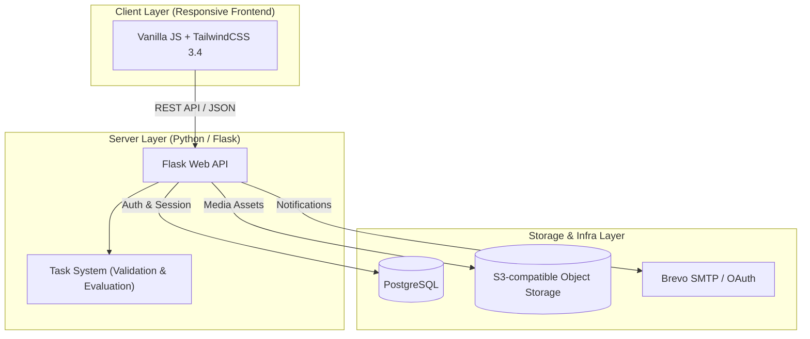

# ACTRA

**Turn Passive Learning into Active Practice.** 
Convert static theory, reading lists, and lectures into interactive study sessions, smart spaced repetition, and retention analytics.

**English** | [Читать на русском](README.ru.md) | [Читати українською](README.uk.md)

---

## The Vision: Active Recall & Spaced Repetition

ACTRA is built for active learners, students, educators, and professionals who want to maximize retention and study efficiency. By bridging theoretical content with interactive retrieval practice, ACTRA prevents passive-reading fatigue and helps you build durable memory.

The platform is designed around the core principle that **simply reading text is not enough to store information**. ACTRA transforms passive study materials into interactive tasks, links them back to their theoretical foundations, and systematically feeds them to users through a memory health tracking schedule.

---

## Core System Architecture

ACTRA is engineered as a modern, lightweight hosted web application with client-side interactivity and robust backend storage:

---

## Platform Capabilities & Technical Highlights

### 1. The Interactive Practice Loop & Dynamic Evaluation Engines
ACTRA goes beyond standard text inputs, offering **5 distinct, kinetic task types** powered by custom evaluation algorithms on the backend:

*   **Spatial Recognition (Click)**: Tap precise hotspot zones on images. The system uses coordinate-matching and point-in-polygon containment checks to verify spatial recall of anatomical structures, maps, or technical schematics.
*   **Trace & Path (Draw)**: Draw vectors, paths, or custom flows. The engine evaluates user coordinate inputs against reference vector paths in real time on an SVG canvas.
*   **Knowledge Checkpoints (Test)**: Traditional single or multi-select formats featuring immediate correction feedback and pedagogical explanation routing.
*   **Recall Recall (Open Answer)**: Type text-based answers validated by a smart, rules-based fuzzy matching engine. It ignores casing, minor punctuation, or layout typos (translating keyboard layouts, e.g. qwerty to cyrillic) while ensuring key concept term containment and Levenshtein edit distance typo tolerance.
*   **Logical Ordering (Sequence)**: Drag-and-drop chronological sorting to test historical events, code execution lines, or operational procedures.

### 2. Contextual Theory Linkage (Theory Bridge)
ACTRA establishes a clear pedagogical bridge between study sets (complexes) and reference articles. Once the practice session is completed, a direct "To Theory" button appears on the final results screen, allowing you to instantly jump back to the corresponding article in the Theory Center or editor for deep revision and mistake analysis.

### 3. Real-Time Session Persistence
Progress is synced server-side at each task boundary in real time. Start a complex quiz on your laptop, pause, and continue on your mobile device exactly where you left off, without losing your state.

### 4. Dynamic Difficulty Levels
Tasks dynamically adjust their content and input requirements based on 3 pedagogical difficulty levels managed by the `DifficultyManager`:
*   **Spatial Recognition (Click)**:
    *   *Level 1*: Direct click-only matching of target hotspots.
    *   *Level 2*: Click and label matching (user must tap the hotspot and type the exact name).
    *   *Level 3*: Draw and label matching (user must draw the boundary outline using coordinate tracing and type its label).
*   **Trace & Path (Draw)**:
    *   *Level 1*: Single outline path drawing with tolerance checking.
    *   *Level 2*: Drawing plus text labeling of the structure.
    *   *Level 3*: Drawing multiple connected structures and explaining their relational linkage.
*   **Knowledge Checkpoints (Test)**:
    *   *Level 1*: Standard single or multiple-choice options.
    *   *Level 2+*: Options are hidden, converting the task into an open question requiring textual answer entry.
*   **Logical Ordering (Sequence)**:
    *   *Level 1*: Ordered sorting with helpful element level and block labels displayed.
    *   *Level 2*: Level labels are hidden, requiring text entry of level names while block labels are visible.
    *   *Level 3*: All labels are hidden, requiring text entry of both level and block names.

### 5. The Visual Authoring Suite (CRUD Editors)
Construct your learning catalog with custom visual tools:
*   **Task Editor**: Visual polygon-tracing controls for Click tasks, reference coordinate builders, and media attachments.
*   **Complex Editor**: Drag-and-drop ordering tools to organize tasks into structured modules, map related theory links, and manage publication settings.
*   **Theory Article Editor**: Rich text article creation with automatic background autosaving, draft history logs, and direct S3 cloud storage uploads for attachments.

### 6. Smart Sharing & Central Library Sync
Publish study collections with granular visibility levels (Public Catalog, Access Code, or Private). Other users subscribe to a collection by adding a *linked entry* to their personal library. This prevents database record duplication, allows the author to distribute updates centrally, and keeps the catalog organized.

### 7. Spaced Repetition Engine (Microcards)
Beat the forgetting curve using the integrated flashcard system. Daily reviews are dynamically scheduled based on user response histories, while the memory health dashboard calculates retention scores and charts review consistency.

---

## Free vs. Premium Limits
Free tier accounts contain generous quotas to get started. Exceeding these limits gracefully pauses editing/publishing while keeping existing content fully readable:

*   **Articles (Theory)**: Up to 5 personal articles; up to 10 articles total in the library.
*   **Practice Sets (Complexes)**: Up to 5 personal complexes; up to 10 complexes total in the library.
*   **Interactive Tasks**: Up to 20 personal tasks.
*   **Card Decks (Microcards)**: Up to 4 personal decks; up to 8 decks total in the library.

*If you exceed these limits or your Premium subscription expires, excess content enters a **`premium_archived`** status. You can view, read, and delete archived materials, but editing, publishing, or active practice is suspended until you clear the excess or upgrade.*

---

## Developer Guide & Deployment

Instructions on how to configure environment variables, run the Docker stack, launch local development, or run the test suites (`pytest`, `Vitest`, `Playwright` smoke scripts) have been moved to a separate guide:

👉 **[docs/DEVELOPER_GUIDE.md](docs/DEVELOPER_GUIDE.md)**

---

## Tech Stack Overview

| Layer | Technologies Used |
| --- | --- |
| **Backend** | Python 3.10+, Flask 3.x, Pydantic 2.x, PyMuPDF |
| **Server Engine** | Waitress WSGI |
| **Frontend** | HTML5, Vanilla JavaScript, TailwindCSS 3.4, PostCSS, JSDom |
| **Database** | PostgreSQL |
| **File Server** | S3-compatible Object Storage (MinIO / AWS S3) |
| **Testing Core** | pytest, Vitest, Playwright |
| **CI / CD** | GitHub Actions (automated deployments via SSH on push to `online-hosting`) |
| **Security Audit** | pre-commit, gitleaks, bcrypt |

---

## Repository Structure

*   `desktop-app/` - Core Flask backend (API handlers, database models, S3 integration, authentication flows).
*   `frontend/` - Responsive client files (templates, UI modules, typography, stylesheets).
*   `task_system/` - Execution engine for validation, input parsing, and scoring algorithms.
*   `common/` - shared constants, configuration parsers, and utilities.
*   `docs/` - Comprehensive migration docs, developer guides, database schemas, and architectural outlines.
*   `tests/` - Acceptance, integration, and regression suites.
*   `scripts/` - Automated audits (contrast checks, schema verifications).

---

## License

This project is licensed under the Apache License 2.0. See [LICENSE](LICENSE) for details.
