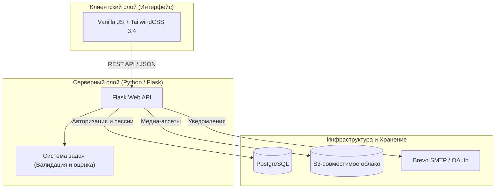

<div align="center">

# ACTRA

**Превратите пассивное обучение в активную практику.**
Переводите сухую теорию, списки литературы и лекции в интерактивные сессии, умное интервальное повторение и наглядную аналитику удержания знаний.

[Read in English](README.md) | **Русский**

[](https://python.org)
[](https://flask.palletsprojects.com)
[](https://tailwindcss.com)
[](LICENSE)
[](https://github.com/hippo2222/ACTRA/actions/workflows/ci.yml)

</div>

---

## О проекте

ACTRA создана для студентов, преподавателей и профессионалов, которые хотят повысить эффективность учебы и усвоения информации. Связывая теорию с мгновенной практикой, платформа помогает преодолеть пассивное забывание информации и сформировать долгосрочные знания.

> [!IMPORTANT]
> **Hosted-First продукт**: Сервис полностью оптимизирован для работы в веб-окружении (SaaS/Self-hosted). Устаревшие сборки под Windows Desktop и Webview сохранены в кодовой базе только как legacy-справочник; вся активная разработка, подписки, автоматический деплой и новые фичи нацелены исключительно на веб-версию.

---

## Архитектура системы

ACTRA спроектирована как отзывчивое веб-приложение с интерактивным интерфейсом и надежным бэкендом:



---

## Ключевые возможности

### 1. Интерактивный цикл практики (Practice Loop)
Мы отказались от скучного ввода текста в пользу **5 кинетических типов заданий**:
*   **Выбор областей (Click)**: Нажимайте на активные зоны (hotspots) изображений для запоминания схем, анатомических карт или чертежей.
*   **Векторное рисование (Draw)**: Обводите контуры или траектории с автоматической проверкой точности рисования в реальном времени.
*   **Тесты с выбором вариантов (Test)**: Традиционные опросы с выбором одного или нескольких ответов и моментальным результатом.
*   **Свободный ввод (Open Answer)**: Текстовые ответы, проверяемые интеллектуальными фильтрами оценки.
*   **Логические цепочки (Sequence)**: Расставляйте блоки или этапы процессов в хронологическом и логическом порядке.

### 2. Контекстная связь с теорией
Учитесь осмысленно. Если задание кажется сложным, откройте прикрепленную теоретическую статью прямо во встроенной панели рядом с вопросом. Изучите материал и тут же примените его для решения задачи.

### 3. Сохранение прогресса (Session Persistence)
Состояние тренировок синхронизируется на сервере в реальном времени. Начните проходить комплекс на компьютере, приостановите и продолжите на телефоне ровно с того места, где остановились.

### 4. Встроенный редактор контента (Authoring Suite)
Создавайте собственные учебные материалы с помощью визуальных редакторов для задач, комплексов и статей. Поддерживается фоновое автосохранение, история версий и загрузка медиафайлов напрямую в облако S3.

### 5. Общий каталог и библиотеки
Делитесь учебными наборами в каталоге репозитория. Другие пользователи могут добавить их в свою библиотеку в виде ссылки (linked entry). Это позволяет им проходить ваши задания, не дублируя и не забивая базу лишними копиями.

### 6. Календарь здоровья памяти (Microcards)
Боритесь с забыванием с помощью встроенной системы интервального повторения. Карточки (microcards) автоматически группируются на основе ваших ответов, а дашборд визуализирует текущее состояние здоровья памяти.

---

## Лимиты тарифов и архив
Для бесплатного использования действуют автоматические лимиты. Превышение лимитов безопасно переводит избыточные материалы в архив, сохраняя к ним доступ для чтения:

*   **Статьи теории**: до 5 личных статей; до 10 статей всего в библиотеке.
*   **Комплексы (наборы задач)**: до 5 личных комплексов; до 10 комплексов всего в библиотеке.
*   **Интерактивные задания**: до 20 личных заданий.
*   **Колоды карточек**: до 4 личных колод; до 8 колод всего в библиотеке.

*Если лимиты превышены или закончилась Premium-подписка, лишние материалы получают статус **`premium_archived`**. Их можно читать и удалять, но редактирование, прохождение и публикация блокируются до очистки лимитов или перехода на тариф Premium.*

---

## Руководство разработчика и Запуск

<details>
<summary><b>1. Запуск через Docker Compose (Рекомендуется)</b></summary>
<p></p>

Самый надежный способ развернуть полный стек локально:

1. **Настройка переменных окружения**:
   Скопируйте пример конфига и заполните секреты (OAuth, S3, SMTP):
   ```bash
   cp .env.hosted.example .env.hosted
   ```
2. **Сборка и запуск контейнеров**:
   ```bash
   docker compose --env-file .env.hosted -f docker-compose.hosted.yml up -d --build
   ```
3. **Ссылки для проверки**:
   - Приложение: `http://localhost:8000`
   - Локальный перехватчик почты Mailpit: `http://localhost:8025`
4. **Остановка**:
   ```bash
   docker compose --env-file .env.hosted -f docker-compose.hosted.yml down
   ```

</details>

<details>
<summary><b>2. Локальная разработка (Без Docker)</b></summary>
<p></p>

Для быстрой отладки фронтенда и бэкенда:

1. **Создание и активация виртуального окружения**:
   ```bash
   python -m venv .venv
   # Windows:
   .venv\Scripts\activate
   # macOS/Linux:
   source .venv/bin/activate
   ```
2. **Установка зависимостей**:
   ```bash
   pip install -e ".[dev]"
   npm ci
   ```
3. **Компиляция ассетов**:
   ```bash
   npm run build:css
   ```

</details>

<details>
<summary><b>3. Автоматизированные тесты</b></summary>
<p></p>

Проверка целостности кодовой базы:

```bash
# Запуск тестов бэкенда (pytest)
pytest

# Запуск тестов фронтенда (Vitest)
npm test

# Валидация кастомных переменных тем Tailwind
npm run validate:themes

# Статические линтеры и проверка на утечки секретов
python -m pre_commit run --all-files
```

### Приемочные и интеграционные тесты (Smoke & Acceptance)
```bash
# Проверка контрактов компонентов и готовности к запуску
npm run smoke:launch-contract:hosted

# Полный приемочный тест (регистрация и прохождение комплекса)
npm run smoke:launch-acceptance:hosted

# Индивидуальное тестирование отдельных модулей
npm run smoke:complex-passage:hosted
npm run smoke:catalog-library:hosted
npm run smoke:microcards:hosted
npm run smoke:import-export:hosted
```

</details>

---

## Технологический стек

| Слой | Технологии |
| --- | --- |
| **Backend** | Python 3.10+, Flask 3.x, Pydantic 2.x, PyMuPDF |
| **WSGI-сервер** | Waitress WSGI |
| **Frontend** | HTML5, Vanilla JavaScript, TailwindCSS 3.4, PostCSS, JSDom |
| **База данных** | PostgreSQL |
| **Хранилище файлов** | S3-совместимое облачное хранилище (MinIO / AWS S3) |
| **Тесты** | pytest, Vitest, Playwright |
| **CI / CD** | GitHub Actions (деплой по SSH при пуше в `online-hosting`) |
| **Безопасность** | pre-commit, gitleaks, bcrypt |

---

## Структура репозитория

*   `desktop-app/` — Бэкенд на Flask (обработчики API, модели БД, интеграция S3, логика авторизации).
*   `frontend/` — Клиентская часть (шаблоны, модули UI, шрифты, стили).
*   `task_system/` — Ядро валидации, парсинга ответов и алгоритмов оценки.
*   `common/` — Общие утилиты, парсеры конфигураций и константы.
*   `docs/` — Документация по миграции, схемы БД и архитектура.
*   `tests/` — Интеграционные, юнит и регрессионные тесты.
*   `scripts/` — Скрипты автоматического аудита (контрастность UI, валидность БД).

---

## Лицензия

Проект распространяется под лицензией Apache License 2.0. Подробности см. в файле [LICENSE](LICENSE).
