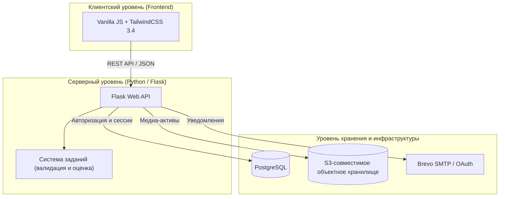

# ACTRA

**Превратите пассивное обучение в активную практику.** 
Преобразуйте статичную теорию, списки литературы и лекции в интерактивные практические сессии, умное интервальное повторение и аналитику усвоения знаний.

[Read in English](README.md) | **Русский** | [Читати українською](README.uk.md)

---

## Концепция: Активное припоминание и интервальное повторение

ACTRA создана для активных студентов, преподавателей и профессионалов, стремящихся максимизировать запоминание и эффективность обучения. Связывая теоретический материал с интерактивной практикой припоминания (retrieval practice), ACTRA избавляет от усталости при пассивном чтении и помогает формировать долгосрочную память.

Платформа спроектирована вокруг главного принципа: **простого чтения текста недостаточно для надежного усвоения информации**. ACTRA трансформирует пассивные учебные материалы в интерактивные задания, связывает их с теоретическим базисом и систематически предлагает пользователю для повторения на основе графиков здоровья памяти.

---

## Архитектура системы

ACTRA реализована как современное веб-приложение с интерактивным клиентом и надежным бэкендом для хранения данных:

---

## Возможности платформы и технические особенности

### 1. Интерактивный цикл практики и движки оценки ответов
ACTRA выходит за рамки обычного текстового ввода и предлагает **6 уникальных типов практических заданий**, оцениваемых бэкенд-алгоритмами в реальном времени:

*   **Пространственное распознавание (Клик)**: Выбор точных зон-хотспотов на изображениях. Система использует сопоставление координат и алгоритмы проверки нахождения точки внутри многоугольника (point-in-polygon) для проверки знания анатомии, карт или технических схем.
*   **Трассировка и пути (Рисование)**: Рисование векторов, траекторий или пользовательских схем. Движок сопоставляет нарисованные пользователем штрихи с эталонным векторным путем на SVG-холсте в реальном времени.
*   **Контрольные точки (Тест)**: Стандартный тест с выбором одного или нескольких вариантов ответов, поддержкой нескольких правильных ответов, добавлением изображений в сам вопрос (до 3 штук) и в варианты ответа. Предоставляет моментальную обратную связь и вывод пояснений к ошибкам.
*   **Поиск ошибок (Ошибки)**: Клик по конкретным словам или текстовым токенам в блоке текста, содержащем намеренные грамматические, смысловые или фактические ошибки. Бэкенд сопоставляет индексы выбранных слов с эталонным ключом для оценки правильных и ложных срабатываний.
*   **Проверка формулировок (Открытый ответ)**: Ввод текстового ответа, проверяемый умным эвристическим движком. Алгоритм игнорирует регистр, пунктуацию и случайные опечатки (включая автоматическое исправление раскладки клавиатуры, например, с английской на русскую), рассчитывает расстояние Левенштейна (до 2 опечаток), учитывает морфологию (стемминг окончаний) и нормализует буквы Ё/Е и И/Й/Ы.
*   **Логическое упорядочивание (Сборка схем)**: Сортировка элементов перетаскиванием (drag-and-drop) для проверки знания хронологии исторических событий, шагов алгоритма или порядка выполнения процедур.

### 2. Контекстная связь с теорией (Мост к теории)
ACTRA устанавливает четкий педагогический мост между практическими наборами (комплексами) и справочными статьями. Перед началом прохождения любого комплекса вы можете открыть и прочитать привязанную теоретическую статью прямо со страницы списка комплексов в один клик — это быстрый и удобный способ повторить ключевые концепции перед началом активной практики.

### 3. Автосохранение и персистентность сессий
Прогресс прохождения комплексов синхронизируется на сервере в реальном времени при завершении каждого шага. Вы можете начать проходить комплекс на компьютере, приостановить и продолжить на смартфоне ровно с того же вопроса, не потеряв свой прогресс.

### 4. Динамические уровни сложности
Задания автоматически адаптируют свое содержимое и требования к вводу на основе 3 педагогических уровней сложности, управляемых через `DifficultyManager`:
*   **Пространственное распознавание (Клик)**:
    *   *Уровень 1*: Прямой выбор целевой зоны (клик).
    *   *Уровень 2*: Клик с указанием названия (нужно кликнуть на зону и ввести её точное текстовое название).
    *   *Уровень 3*: Рисование контура с указанием названия (нужно обвести границы зоны точками и ввести её название).
*   **Трассировка и пути (Рисование)**:
    *   *Уровень 1*: Рисование одного контура с проверкой точности попадания.
    *   *Уровень 2*: Рисование контура с вводом текстового названия структуры.
    *   *Уровень 3*: Рисование нескольких связанных структур с описанием их взаимосвязи.
*   **Контрольные точки (Тест)**:
    *   *Уровень 1*: Классический тест с выбором одного или нескольких вариантов.
    *   *Уровень 2+*: Варианты ответов скрываются, превращая задание в открытый вопрос, требующий ручного ввода текста.
*   **Логическое упорядочивание (Сборка схем)**:
    *   *Уровень 1*: Сортировка с отображением подсказок уровней и блоков.
    *   *Уровень 2*: Названия уровней скрыты (требуется ввести их вручную), названия блоков отображаются.
    *   *Уровень 3*: Все подписи скрыты (требуется ввести вручную названия и уровней, и блоков).

### 5. Визуальные редакторы для создания контента (CRUD)
Конструируйте учебные материалы с помощью встроенных инструментов автора:
*   **Редактор заданий**: Инструменты разметки многоугольников на изображениях, построение эталонных координат и привязка медиафайлов.
*   **Редактор комплексов**: Конструктор модулей с сортировкой перетаскиванием, связыванием теоретических статей и настройкой публикации.
*   **Редактор теории**: Полноценный текстовый редактор с фоновым автосохранением, историей черновиков и прямой загрузкой медиафайлов в облачное хранилище S3.

### 6. Умный шеринг и синхронизация личных библиотек
Публикуйте учебные материалы с гибким доступом (Публичный каталог, по коду доступа или приватные). Другие пользователи подписываются на материалы, создавая *ссылочную запись* в своей библиотеке. Это исключает дублирование контента в БД, позволяет автору мгновенно рассылать обновления и сохраняет порядок в библиотеке.

### 7. Интервальное повторение (Микрокарточки)
Боритесь с кривой забывания с помощью встроенных колод флеш-карточек. Система автоматически планирует ежедневные повторения на основе истории ответов пользователя, а дашборд здоровья памяти рассчитывает индекс сохранения знаний и строит графики регулярности занятий. Поддерживается пакетный импорт флеш-карточек из текстовых файлов или результатов внешнего анализа. Для соблюдения политик безопасности (CSP) прямая вставка ссылок на сторонние изображения заблокирована; однако вы можете снабжать карточки открытыми иллюстрациями, безопасно загружаемыми через SSRF-защищенный серверный прокси из баз **Wikimedia Commons** или **Openverse** (Flickr CC) с автоматическим импортом данных об авторстве.

---

## Лимиты тарифов: Free vs. Premium
Бесплатные аккаунты включают достаточные квоты для комфортного старта. В случае превышения лимитов редактирование и публикация новых материалов приостанавливаются, но существующие остаются полностью доступными для чтения и повторения:

*   **Статьи (Теория)**: до 5 личных статей; до 10 статей всего в библиотеке.
*   **Наборы практики (Комплексы)**: до 5 личных комплексов; до 10 комплексов всего в библиотеке.
*   **Интерактивные задания**: до 20 личных заданий.
*   **Колоды карт (Микрокарточки)**: до 4 личных колод; до 8 колод всего в библиотеке.

*Если лимиты превышены или закончилась Premium-подписка, лишние материалы получают статус **`premium_archived`**. Их можно читать и удалять, но редактирование, прохождение и публикация блокируются до очистки лимитов или перехода на тариф Premium.*

---

## Руководство разработчика и запуск

Инструкции по настройке переменных окружения, запуску в Docker, локальной разработке и запуску автоматических тестов (`pytest`, `Vitest`, дымовых тестов `Playwright`) вынесены в отдельный файл:

👉 **[docs/DEVELOPER_GUIDE.md](docs/DEVELOPER_GUIDE.md)**

---

## Технологический стек

| Слой | Используемые технологии |
| --- | --- |
| **Бэкенд** | Python 3.10+, Flask 3.x, Pydantic 2.x, PyMuPDF |
| **Сервер приложений** | Waitress WSGI |
| **Фронтенд** | HTML5, Vanilla JavaScript, TailwindCSS 3.4, PostCSS, JSDom |
| **База данных** | PostgreSQL |
| **Хранилище файлов** | S3-совместимое объектное хранилище (MinIO / AWS S3) |
| **Тестирование** | pytest, Vitest, Playwright |
| **CI / CD** | GitHub Actions (автоматический деплой по SSH при пуше в ветку `online-hosting`) |
| **Безопасность** | pre-commit, gitleaks, шифрование bcrypt |

---

## Структура репозитория

*   `desktop-app/` — Бэкенд на Flask (обработчики API, модели данных, интеграция с S3, авторизация).
*   `frontend/` — Адаптивные файлы клиента (шаблоны, модули интерфейса, стили).
*   `task_system/` — Алгоритмы оценки ответов, проверки координат и начисления баллов.
*   `common/` — Общие константы, парсеры конфигураций и утилиты.
*   `docs/` — Документация по миграциям, схемы базы данных и описания архитектуры.
*   `tests/` — Интеграционные, модульные и регрессионные тесты.
*   `scripts/` — Скрипты автоматической проверки (проверка контрастности UI, верификация схем БД).

---

## Лицензия

Проект распространяется на условиях лицензии Apache License 2.0. Подробности см. в файле [LICENSE](LICENSE).
