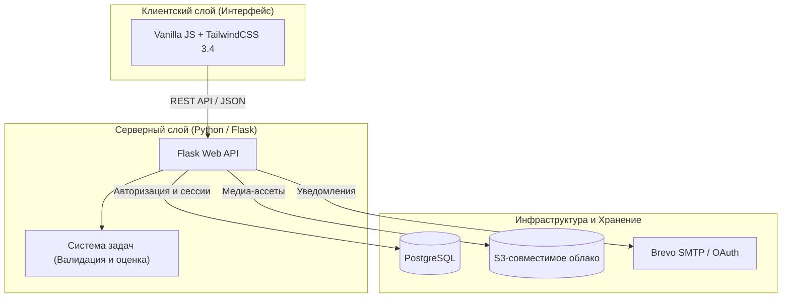

# ACTRA

**Превратите пассивное обучение в активную практику.**
Переводите сухую теорию, списки литературы и лекции в интерактивные сессии, умное интервальное повторение и наглядную аналитику удержания знаний.

[Read in English](README.md) | **Русский**

---

## Концепция: Активное припоминание и Интервальное повторение

ACTRA создана для студентов, преподавателей и профессионалов, которые хотят повысить эффективность учебы и усвоения информации. Связывая теорию с мгновенной практикой, платформа помогает преодолеть пассивное забывание информации и сформировать долгосрочные знания.

Проект построен на фундаментальном принципе: **простого чтения текста недостаточно для усвоения знаний**. ACTRA превращает пассивные материалы в интерактивные задания, связывает их с теоретическим базисом и систематически выдает пользователю, отслеживая индекс здоровья памяти.

---

## Архитектура системы

ACTRA спроектирована как отзывчивое веб-приложение с интерактивным интерфейсом и надежным бэкендом:

---

## Ключевые возможности и Технологические особенности

### 1. Интерактивный цикл практики и Движки оценки ответов
Мы отказались от скучного ввода текста в пользу **5 кинетических типов заданий**, управляемых специализированными алгоритмами проверки на бэкенде:

*   **Выбор областей (Click)**: Нажимайте на активные зоны (hotspots) изображений. Система использует сопоставление координат и алгоритмы проверки вхождения точки в полигон (point-in-polygon) для проверки пространственной памяти (анатомические структуры, карты, технические схемы).
*   **Векторное рисование (Draw)**: Рисуйте векторы, линии или траектории. Движок сопоставляет координаты ввода пользователя с референсными путями в реальном времени прямо на холсте SVG.
*   **Контрольные точки (Test)**: Традиционные опросы с выбором одного или нескольких вариантов ответов, мгновенным результатом и показом подробных объяснений к ошибкам.
*   **Свободный ввод (Open Answer)**: Текстовые ответы, проверяемые интеллектуальным движком нечеткого сравнения. Он игнорирует регистр букв, мелкую пунктуацию или опечатки в раскладке клавиатуры, оценивая наличие ключевых понятий.
*   **Логические цепочки (Sequence)**: Перетаскивание элементов в правильном хронологическом или логическом порядке для проверки алгоритмов или исторических таймлайнов.

### 2. Контекстная связь с теорией (Split-Pane)
Зубрежка неэффективна без понимания. Если задание вызывает сложности, пользователь может открыть привязанную статью теории в соседней панели того же экрана. Прочитайте объяснение и сразу же примените его для решения текущей задачи, не переключая вкладки.

### 3. Полноценное сохранение сессий (Session Persistence)
Состояние тренировок синхронизируется на сервере в реальном времени при завершении каждого задания. Начните проходить комплекс на компьютере, приостановите и продолжите на телефоне ровно с того места, где остановились, не теряя контекст.

### 4. Встроенный редактор контента (Authoring Suite)
Создавайте собственные учебные материалы с помощью визуальных редакторов:
*   **Редактор заданий**: Рисование областей клика (полигонов), настройка векторов и управление вложениями.
*   **Редактор комплексов**: Удобное перетаскивание заданий, привязка теоретических статей и гибкая настройка прав доступа.
*   **Редактор теории**: Написание статей с автоматическим фоновым сохранением черновиков, историей изменений и загрузкой медиа напрямую в S3.

### 5. Модель связанных библиотек (Central Sync)
Публикуйте учебные наборы в каталоге с гибкими правами (Публично, По коду доступа или Приватно). Подписка на чужой комплекс создает *ссылку* (linked entry) в библиотеке пользователя. Это позволяет автору централизованно обновлять материалы, защищает от хаотичных форков и предотвращает раздувание базы дубликатами.

### 6. Интервальное повторение (Microcards)
Боритесь с забыванием с помощью встроенной системы интервального повторения. Карточки (microcards) автоматически распределяются на повторения в зависимости от истории ответов пользователя, а дашборд визуализирует текущее состояние здоровья памяти.

---

## Лимиты тарифов и архив
Для бесплатного использования действуют автоматические лимиты. Превышение лимитов безопасно переводит избыточные материалы в архив, сохраняя к ним доступ для чтения:

*   **Статьи теории**: до 5 личных статей; до 10 статей всего в библиотеке.
*   **Комплексы (наборы задач)**: до 5 личных комплексов; до 10 комплексов всего в библиотеке.
*   **Интерактивные задания**: до 20 личных заданий.
*   **Колоды карточек**: до 4 личных колод; до 8 колод всего в библиотеке.

*Если лимиты превышены или закончилась Premium-подписка, лишние материалы получают статус **`premium_archived`**. Их можно читать и удалять, но редактирование, прохождение и публикация блокируются до очистки лимитов или перехода на тариф Premium.*

---

## Руководство разработчика и Запуск

Инструкции по настройке переменных окружения, развертыванию Docker-стека, локальной установке зависимостей и запуску тестовых сценариев (`pytest`, `Vitest`, smoke-тесты Playwright) вынесены в отдельный документ:

👉 **[docs/DEVELOPER_GUIDE.md](docs/DEVELOPER_GUIDE.md)**

---

## Технологический стек

| Слой | Технологии |
| --- | --- |
| **Backend** | Python 3.10+, Flask 3.x, Pydantic 2.x, PyMuPDF |
| **WSGI-сервер** | Waitress WSGI |
| **Frontend** | HTML5, Vanilla JavaScript, TailwindCSS 3.4, PostCSS, JSDom |
| **База данных** | PostgreSQL |
| **Хранилище файлов** | S3-сомместимое облачное хранилище (MinIO / AWS S3) |
| **Тесты** | pytest, Vitest, Playwright |
| **CI / CD** | GitHub Actions (деплой по SSH при пуше в `online-hosting`) |
| **Безопасность** | pre-commit, gitleaks, bcrypt |

---

## Структура репозитория

*   `desktop-app/` — Бэкенд на Flask (обработчики API, модели БД, интеграция S3, логика авторизации).
*   `frontend/` — Клиентская часть (шаблоны, модули UI, шрифты, стили).
*   `task_system/` — Ядро валидации, парсинга ответов и алгоритмов оценки.
*   `common/` — Общие утилиты, парсеры конфигураций и константы.
*   `docs/` — Документация по миграции, руководства, схемы БД и архитектура.
*   `tests/` — Интеграционные, юнит и регрессионные тесты.
*   `scripts/` — Скрипты автоматического аудита (контрастность UI, валидность БД).

---

## Лицензия

Проект распространяется под лицензией Apache License 2.0. Подробности см. в файле [LICENSE](LICENSE).
