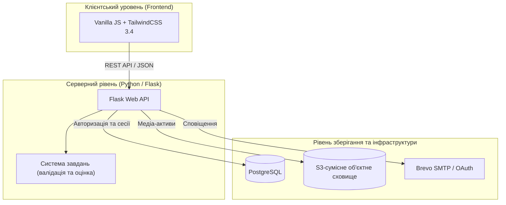

# ACTRA

**Перетворіть пасивне навчання на активну практику.** 
Перетворіть статичну теорію, списки літератури та лекції на інтерактивні практичні сесії, розумне інтервальне повторення та аналітику засвоєння знань.

[Read in English](README.md) | [Читать на русском](README.ru.md) | **Українська**

---

## Концепція: Активне пригадування та інтервальне повторення

ACTRA створена для активних студентів, викладачів та професіоналів, які прагнуть максимізувати запам'ятовування та ефективність навчання. Зв'язуючи теоретичний матеріал з інтерактивною практикою пригадування (retrieval practice), ACTRA позбавляє втоми від пасивного читання та допомагає формувати довготривалу пам'ять.

Платформа спроектована навколо головного принципу: **простого читання тексту недостатньо для надійного засвоєння інформації**. ACTRA трансформує пасивні навчальні матеріали в інтерактивні завдання, пов'язує їх з теоретичним базисом і систематично пропонує користувачеві для повторення на основі графіків здоров'я пам'яті.

---

## Архітектура системи

ACTRA реалізована як сучасний веб-додаток з інтерактивним клієнтом та надійним бекендом для зберігання даних:

---

## Можливості платформи та технічні особливості

### 1. Інтерактивний цикл практики та движки оцінки відповідей
ACTRA виходить за рамки звичайного текстового введення та пропонує **5 унікальних типів практичних завдань**, що оцінюються бекенд-алгоритмами в реальному часі:

*   **Просторове розпізнавання (Клік)**: Вибір точних зон-хотспотів на зображеннях. Система використовує зіставлення координат та алгоритми перевірки знаходження точки всередині багатокутника (point-in-polygon) для перевірки знання анатомії, карт або технічних схем.
*   **Трасування та шляхи (Малювання)**: Малювання векторів, траєкторій або користувацьких схем. Движок зіставляє намальовані користувачем штрихи з еталонним векторним шляхом на SVG-полотні в реальному часі.
*   **Контрольні точки (Тест)**: Класичний вибір одного або кількох варіантів відповідей з миттєвим зворотним зв'язком та виведенням пояснень до помилок.
*   **Перевірка формулювань (Відкрита відповідь)**: Введення текстової відповіді, що перевіряється розумним евристичним движком. Алгоритм ігнорує регістр, пунктуацію та випадкові друкарські помилки (включаючи автоматиче виправлення розкладки клавіатури, наприклад, з англійської на українську), розраховує відстань Левенштейна (до 2 помилок), враховує морфологію (стемінг закінчень) та нормалізує літери Е/Є/Ё, И/Й/І/Ї/Ы.
*   **Логічне упорядкування (Збірка схем)**: Сортування елементів перетягуванням (drag-and-drop) для перевірки знання хронології історичних подій, кроків алгоритму або порядку виконання процедур.

### 2. Контекстний зв'язок з теорією (Мост до теорії)
ACTRA встановлює чіткий педагогічний міст між практичними наборами (комплексами) та довідковими статтями. Після завершення сесії на фінальному екрані результатів з'являється пряма кнопка «До теорії», яка дозволяє користувачеві миттєво перейти до відповідної статті в Центрі теорії або редакторі для детального розбору помилок та закріплення матеріалу.

### 3. Автозбереження та персистентність сесій
Прогрес проходження комплексів синхронізується на сервері в реальном часі при завершенні кожного кроку. Ви можете почати проходити комплекс на комп'ютері, призупинити і продовжити на смартфоні рівно з того ж питання, не втративши свій прогрес.

### 4. Динамічні рівні складності
Завдання автоматично адаптують свій вміст та вимоги до введення на основі 3 педагогічних рівнів складності, якими керує `DifficultyManager`:
*   **Просторове розпізнавання (Клік)**:
    *   *Рівень 1*: Прямий вибір цільової зони (клік).
    *   *Рівень 2*: Клік із зазначенням назви (потрібно клікнути на зону та ввести її точну текстову назву).
    *   *Рівень 3*: Малювання контуру із зазначенням назви (потрібно обвести межі зони точками та ввести її назву).
*   **Трасування та шляхи (Малювання)**:
    *   *Рівень 1*: Малювання одного контуру з перевіркою точності потрапляння.
    *   *Рівень 2*: Малювання контуру з введенням текстової назви структури.
    *   *Рівень 3*: Малювання кількох пов'язаних структур з описом їхнього взаємозв'язку.
*   **Контрольні точки (Тест)**:
    *   *Рівень 1*: Класичний тест із вибором одного або кількох варіантів.
    *   *Рівень 2+*: Варіанти відповідей приховуються, перетворюючи завдання на відкрите питання, що вимагає ручного введення тексту.
*   **Логічне упорядкування (Збірка схем)**:
    *   *Рівень 1*: Сортування з відображенням підказок рівнів та блоків.
    *   *Рівень 2*: Назви рівнів приховані (потрібно ввести їх вручну), назви блоків відображаються.
    *   *Рівень 3*: Усі підписи приховані (потрібно ввести вручну назви і рівнів, і блоків).

### 5. Візуальні редактори для створення контенту (CRUD)
Конструюйте навчальні матеріали за допомогою вбудованих інструментів автора:
*   **Редактор завдань**: Інструменти розмітки багатокутників на зображеннях, побудова еталонних координат та прив'язка медіафайлів.
*   **Редактор комплексів**: Конструктор модулів із сортуванням перетягуванням, зв'язуванням теоретичних статей та налаштуванням публікації.
*   **Редактор теорії**: Повноцінний текстовий редактор із фоновим автозбереженням, історією чернеток та прямою завантаженням медіафайлів до хмарного сховища S3.

### 6. Розумний шерінг та синхронізація особистих бібліотек
Публікуйте навчальні матеріали з гнучким доступом (Публічний каталог, за кодом доступу або приватні). Інші користувачі підписуються на матеріали, створюючи *посилальний запис* у своїй бібліотеці. Це виключає дублювання контенту в БД, дозволяє автору миттєво розсилати оновлення та зберігає порядок у бібліотеці.

### 7. Інтервальне повторення (Мікрокартки)
Боріться з кривою забування за допомогою вбудованих колод флеш-карток. Система автоматично планує щоденні повторення на основі історії відповідей користувача, а дашборд здоров'я пам'яті розраховує індекс збереження знань та будує графіки регулярності занять.

---

## Ліміти тарифів: Free vs. Premium
Безкоштовні акаунти включають достатні квоти для комфортного старту. У разі перевищення лімітів редагування та публікація нових матеріалів призупиняються, але існуючі залишаються повністю доступними для читання та повторення:

*   **Статті (Теорія)**: до 5 особистих статей; до 10 статей всього в бібліотеці.
*   **Набори практики (Комплекси)**: до 5 особистих комплексів; до 10 комплексів всього в бібліотеці.
*   **Interactive Tasks**: до 20 особистих завдання.
*   **Колоди карт (Мікрокартки)**: до 4 особистих колод; до 8 колод всього в бібліотеці.

*Якщо ліміти перевищено або закінчилася Premium-підписка, зайві матеріали отримують статус **`premium_archived`**. Їх можна читати та видаляти, но редагування, проходження та публікація блокуються до очищення лімітів або переходу на тариф Premium.*

---

## Посібник розробника та запуск

Інструкції щодо налаштування змінних оточення, запуску в Docker, локальної розробки та запуску автоматичних тестів (`pytest`, `Vitest`, димових тестів `Playwright`) винесено в окремий файл:

👉 **[docs/DEVELOPER_GUIDE.md](docs/DEVELOPER_GUIDE.md)**

---

## Технологічний стек

| Шар | Використовувані технології |
| --- | --- |
| **Бекенд** | Python 3.10+, Flask 3.x, Pydantic 2.x, PyMuPDF |
| **Сервер додатків** | Waitress WSGI |
| **Фронтенд** | HTML5, Vanilla JavaScript, TailwindCSS 3.4, PostCSS, JSDom |
| **База даних** | PostgreSQL |
| **Сховище файлів** | S3-сумісне об'єктне сховище (MinIO / AWS S3) |
| **Тестування** | pytest, Vitest, Playwright |
| **CI / CD** | GitHub Actions (автоматичний деплой по SSH при пуші у гілку `online-hosting`) |
| **Безпека** | pre-commit, gitleaks, шифрування bcrypt |

---

## Структура репозиторію

*   `desktop-app/` — Бекенд на Flask (обробники API, модели даних, інтеграція з S3, авторизація).
*   `frontend/` — Адаптивні файли клієнта (шаблони, модулі інтерфейсу, стилі).
*   `task_system/` — Алгоритми оцінки відповідей, перевірки координат та нарахування балів.
*   `common/` — Загальні константи, парсери конфігурацій та утиліти.
*   `docs/` — Документація з міграцій, схеми бази даних та описи архітектури.
*   `tests/` — Інтеграційні, модульні та регресійні тести.
*   `scripts/` — Скрипти автоматичної перевірки (перевірка контрастності UI, верифікація схем БД).

---

## Ліцензія

Проект розповсюджується на умовах ліцензії Apache License 2.0. Деталі див. у файлі [LICENSE](LICENSE).
