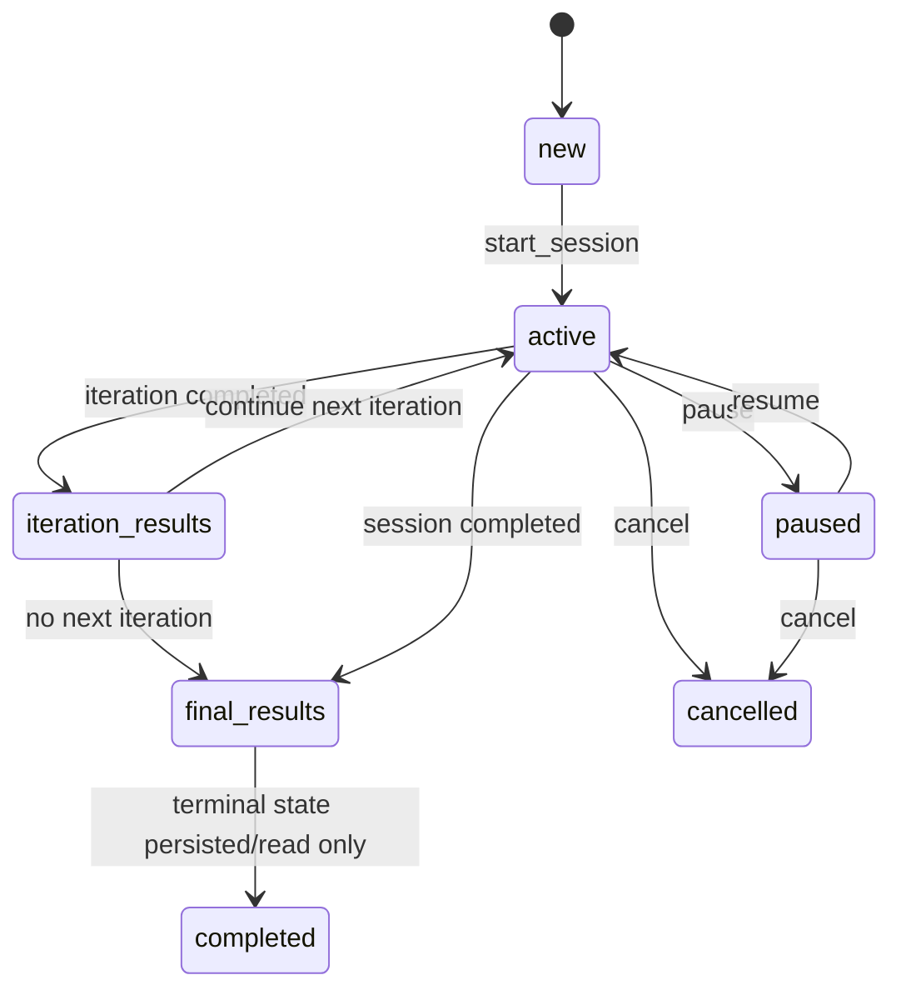

# Complex Passage Canonical Spec

Дата обновления: `2026-04-17`

## Зачем нужен этот документ

Этот документ фиксирует текущий поддерживаемый контракт домена "прохождение комплексов" в hosted web runtime.
Он нужен как единый эталон перед этапами hosted persistence, statistics persistence и runtime isolation.

Если код, старые заметки и этот документ расходятся, приоритет у:
1. фактического runtime-контракта, подтвержденного целевыми тестами;
2. этого документа;
3. старых planning-заметок.

## Источники истины

Основные файлы, из которых выведен этот контракт:

- `desktop-app/api/session_api.py`
- `desktop-app/routes/session_routes.py`
- `desktop-app/routes/static_routes.py`
- `desktop-app/services/adaptive_session_manager.py`
- `task_system/core/models/complex_models.py`
- `frontend/S1/main.js`
- `frontend/S1/session-controls.js`
- `frontend/S1/task-renderer.js`
- `frontend/S2/index.html`
- `frontend/assets/s2-results.js`
- `tests/complex_audit/complex_wave1_smoke.test.mjs`
- `tests/complex_audit/complex_wave1_reload.test.mjs`
- `tests/complex_audit/complex_wave1_queue_pause_difficulty.test.mjs`

## Scope

В scope этого spec входят:

- старт новой сессии комплекса;
- получение текущего задания;
- submit/check, `next`, `pause`, `resume`, `cancel`;
- сохранение и восстановление `ui_state`;
- переходы `S1 -> S2 -> S3`;
- retry/skip semantics;
- iteration/difficulty semantics;
- resume target contract;
- минимально обязательные persisted-поля session state.

Вне scope:

- hosted storage implementation как таковой;
- гарантия multi-worker concurrency;
- окончательная hosted persistence-модель для statistics/calendar;
- внутренние evaluator-алгоритмы каждого отдельного task type.

## Базовые сущности

### ComplexSession

Session model хранит:

- identity: `id`, `complex_id`, `user_id`, `version`;
- lifecycle: `is_active`, `paused`, `paused_at`, `total_pause_seconds`, `start_time`, `end_time`;
- progression: `iteration`, `current_task_index`, `queue`, `completed_tasks`;
- control/meta: `skip_counts`, `broken_tasks`, `error_detection_tasks`, `test_failed_subtests`, `iteration_timestamps`;
- UI restore state: `ui_state`;
- дополнительные runtime-поля через `extra = "allow"`, включая `paused_resume_target`.

### QueuedTask

Каждый элемент очереди обязан иметь:

- `task_ref`
- `difficulty`
- `is_retry`
- `origin_iteration`

### SessionTaskResult

Каждый завершенный attempt обязан иметь:

- `task_ref`
- `success`
- `time_spent`
- `difficulty`
- `iteration_index`

Опционально:

- `score`
- `timestamp`
- `details`

## Канонические состояния session lifecycle

### 1. `new`

Это переходное состояние до первого успешного `start_session`.
Оно не обязано жить как persisted steady-state.

### 2. `active`

Сессия считается `active`, если одновременно:

- `is_active == True`
- `paused == False`
- у сессии есть текущий прогресс по `queue/current_task_index`

В active-состоянии пользователь находится на одном из UI-экранов:

- `task`
- `task_results`
- `iteration_results`
- `final_results`

Важно:

- `resumed` не является отдельным устойчивым persisted-state;
- после `resume` сессия снова считается обычной `active`.

### 3. `paused`

Сессия считается `paused`, если:

- `is_active == True`
- `paused == True`
- сохранен `paused_at`
- сохранен `paused_resume_target` или может быть вычислен `resume_target` из `ui_state`

### 4. `iteration_results`

Это не отдельный session-state флаг, а UI-state внутри активной сессии.
Его признак:

- `ui_state.screen_type == "iteration_results"`

Сессия при этом может быть:

- активной;
- позже поставленной на паузу, сохранив `resume_target` на S2.

### 5. `final_results`

Это тоже UI-state внутри уже завершенного или логически завершенного прохождения.
Его признак:

- `ui_state.screen_type == "final_results"`

### 6. `completed`

Сессия считается завершенной, когда:

- `is_active == False`, или
- `next_task()` возвращает `session_completed`, или
- дальнейшего task progression больше нет и runtime перешел к S3/финалу.

Для HTTP-контракта это проявляется как:

- `410 session_completed` на `POST /task/next`, или
- доступность `/iteration-results` / `/final-results`.

### 7. `cancelled`

Cancelled означает явную отмену сессии через `cancel_session`.
После cancel сессия не должна продолжать активный runtime-поток.

## Разрешенные переходы

### Главная цепочка

### Дополнительные правила

- `resume` разрешен только из paused-состояния.
- `next` разрешен только если текущее задание считается checked.
- `save_task_ui_state` запрещен для paused session.
- `pause` идемпотентен: повторный pause над уже paused session возвращает `ok: true, paused: true`.
- `resume` после успеха возвращает `resume_target`, а не сам task payload.
- `iteration_results` и `final_results` считаются допустимыми точками resume через `resume_target`.

## HTTP / UI contract по ключевым операциям

### `start_session`

Вход:

- `complex_id`
- `user_id`
- `start_iteration`

Контракт:

- не допускается silent fallback к hosted default user;
- неизвестный complex дает `ok: false`;
- успешный старт создает session и поднимает первый task flow;
- `start_iteration` не должен создавать silent-empty-session.

### `GET /api/session/<id>/task`

Контракт:

- если session не найдена или user mismatch, ответ `404 task_not_found_or_session_mismatch`;
- если session paused, ответ `200 { ok: true, paused: true, task: null }`;
- если session active, возвращается task payload;
- endpoint не должен автоматически снимать паузу сам по себе.

### `submit_answer`

Контракт:

- submit относится только к текущему active task;
- mismatch по `task_id` должен быть отвергнут;
- для shuffled test tasks web-layer нормализует пользовательский ответ в evaluator-safe формат;
- успешный submit переводит UI в `task_results`, а не сразу на следующий task.

### `next_task`

Контракт:

- `next` запрещен, если текущее задание не checked;
- на конец прохождения/итерации runtime может вернуть `session_completed`;
- HTTP-слой маппит `session_completed` в `410`;
- если следующее задание есть, ответ содержит новый task payload.

### `pause_session`

Контракт:

- pause должен уметь сохранить текущий `task_ref`, `task_index`, `user_input`, `view_state`, `evaluation_result`;
- если пользователь был на `iteration_results` или `final_results` и свежего task snapshot не передали, pause сохраняет non-task screen;
- при pause всегда пересобирается `paused_resume_target`, чтобы старый snapshot не перебивал новый.

### `resume_session`

Контракт:

- снимает `paused`, очищает `paused_at`;
- возвращает `resume_target`;
- `resume_target` определяет, куда UI должен вернуться: `task`, `task_results`, `iteration_results`, `final_results`;
- после resume steady-state снова считается `active`.

### `save_task_ui_state`

Контракт:

- работает только для active session;
- принимает только актуальный task slot;
- stale `task_ref` или `task_index` должны давать `stale_task`;
- используется для сохранения draft, checked state и view state между reload/restore.

### `cancel_session`

Контракт:

- cancel доступен для активной или paused session;
- после успешного cancel runtime не должен продолжать progression;
- активный controller state очищается.

### `get_iteration_results`

Контракт:

- если iteration явно передана в URL, используется она;
- иначе приоритет у `ui_state.iteration_number`;
- иначе используется текущая iteration session;
- если summary для текущей iteration не найдена и это не явный запрос, допускается fallback на предыдущую iteration;
- payload для S2 должен быть reload-safe.

### `get_final_results`

Контракт:

- финальный payload должен быть доступен после завершения прохождения;
- S3 должен быть reload-safe;
- payload может содержать дополнительные web-friendly секции (`iterations`, `problem_tasks`), если backend их умеет построить.

## Resume target contract

`resume_target` обязан описывать, куда вернуть пользователя после `resume`.

Минимальный контракт:

- `screen_type`
- `url`

Опционально:

- `task_ref`
- `task_index`
- `iteration_number`

Приоритет источников:

1. `paused_resume_target`, если уже сохранен;
2. `ui_state`, если он валиден;
3. fallback на обычный task URL session.

Разрешенные `screen_type`:

- `task`
- `task_results`
- `iteration_results`
- `final_results`

## UI state contract

`ui_state` является persisted source of truth для restore/reload/resume.

Минимально поддерживаемые поля:

- `screen_type`
- `task_ref`
- `task_index`
- `iteration` или `iteration_number`
- `user_input`
- `view_state`
- `evaluation_result`
- `last_updated`

Поддерживаемые значения `screen_type`:

- `task`
- `task_results`
- `iteration_results`
- `final_results`

Правила:

- `task_results` разрешен только как checked snapshot текущего task;
- если пришел новый draft/view state без `evaluation_result`, stale checked-state не должен "оживать" поверх нового in-progress task;
- `ui_state` может быть использован как источник для reload и для вычисления `resume_target`.

## Правила прогрессии по task/iteration/difficulty

### Task progression

- Основной источник истины для позиции внутри queue: `current_task_index`.
- Для обычного complex flow текущий active slot вычисляется как `current_task_index - 1`.
- Для `daily_mix` применяется отдельная нормализация индекса без этого смещения.

### Checked-before-next invariant

- Переход на следующий task запрещен, пока текущий не получил checked/result state.
- На уровне SessionAPI это проверяется перед `next_task`.

### Retry semantics

- `QueuedTask.is_retry == true` означает retry-копию задания.
- `origin_iteration` хранит iteration, в которой ошибка была допущена впервые.
- Для test tasks поддерживается partial retry по `test_failed_subtests`.
- Для web payload retry дополнительно нормализуется в `retry.variant`:
  - `training`
  - `control`
  - `retry`

### Skip semantics

Поддерживаемые правила:

- skip не удаляет task из iteration, а переносит его в конец очереди;
- retry-копии пропускать нельзя;
- последнее оставшееся задание iteration пропускать нельзя;
- на один `task_ref` действует лимит `MAX_SKIPS_PER_TASK = 2` за iteration;
- счетчик skip сбрасывается при генерации новой iteration.

### Difficulty semantics

- difficulty хранится на уровне `QueuedTask` и `SessionTaskResult`;
- web payload текущего task обязан отдавать текущий `difficulty`;
- S1, S2 и S3 считаются обязанными показывать согласованную difficulty progression;
- если task уже загружен в controller с усилением под уровень сложности, web должен использовать эту enhanced-версию, а не сырой storage snapshot.

## Supported task matrix

На уровне S1 runtime поддерживаются следующие базовые task families:

| Raw type | Поддерживаемые подтипы / ветки | Замечания |
| --- | --- | --- |
| `test` | `single_choice`, `multiple_choice` | поддерживаются draft restore, checked restore, shuffle-safe submit |
| `open_answer` | open text | поддерживаются draft restore и checked restore |
| `sequence_assembly` | sequence flow | поддерживаются draft/view restore |
| `click` | обычный click, `error_detection` | `error_detection` идет через отдельную UI-ветку |
| `draw` | region/manual judgement flows | поддерживается pending manual judgement restore |

Это не обещание, что каждый исторический legacy task в репозитории корректен.
Это означает, что эти семейства входят в поддерживаемый runtime-contract complex passage.

## Persisted fields: minimum required set

Следующие поля считаются обязательными для любого hosted-ready session repository.

### Identity / ownership

- `id`
- `complex_id`
- `user_id`
- `version`

### Lifecycle

- `is_active`
- `paused`
- `paused_at`
- `total_pause_seconds`
- `start_time`
- `end_time`

### Progression

- `iteration`
- `current_task_index`
- `queue`
- `completed_tasks`
- `iteration_timestamps`

### Control / adaptive runtime

- `skip_counts`
- `broken_tasks`
- `error_detection_tasks`
- `test_failed_subtests`

### Restore / UI continuity

- `ui_state`
- `paused_resume_target`

Если будущая hosted persistence не сохраняет хотя бы этот набор, она несовместима с текущим supported contract.

## Invariants

### Ownership / isolation

- session должна читаться только в контексте своего `user_id`;
- mismatch пользователя и session ownership трактуется как `session_not_found`/`mismatch`, а не как silent cross-user access.

### Reload safety

- reload на S1 должен сохранять draft или checked state;
- reload на S2 должен сохранять iteration summary;
- reload на S3 должен сохранять final summary;
- same-tab reload не должен приводить к ложной permanent pause с потерей task state.

### Pause / resume safety

- pause/resume должны возвращать пользователя на тот же logical screen;
- stale `paused_resume_target` не должен перебивать более свежий snapshot;
- active session не должна самопроизвольно становиться paused только из-за GET `current task`.

### UI / backend alignment

- `task_ref`, `task_index`, `iteration` и `screen_type` в restore flow должны ссылаться на один и тот же logical slot;
- stale UI state не должен переигрывать фактический progress index назад.

## Что считается нарушением spec

- silent empty session после некорректного `start_iteration`;
- auto-unpause на простом чтении task endpoint;
- возможность `next` без checked state;
- потеря draft/result state после reload;
- resume не в тот screen;
- cross-user доступ к чужой session;
- hosted implementation, где session contract фактически зависит от process-local controller state и не может быть восстановлен из persisted fields.

## Связанный артефакт

Практический gate/checklist для этого spec живет в:

- [complex_passage_definition_of_done.md](D:/Ai Ai/radioproject_git/docs/hosted_web_migration/complex_passage_definition_of_done.md)
